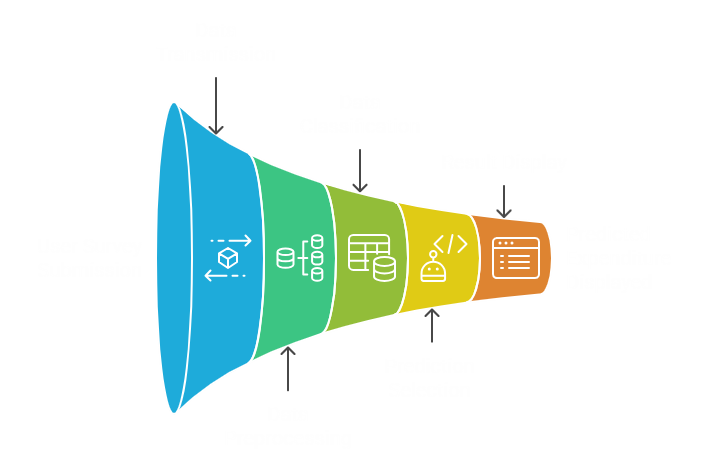

# 📊 Household Consumption Expenditure (HCE) Forecasting System

## 🧩 Overview

This project is a FastAPI-based web application that collects, validates, and analyzes Household Consumption Expenditure (HCE) survey data across Indian states. It visualizes consumption trends with interactive maps and uses trained ML models to predict household expenses. Admin tools allow easy monitoring of data quality.

---

## 🛠️ Prerequisites

- Python 3.8+
- pip
- VS Code Live Server extension (for frontend)
- Recommended: Create a virtual environment using `venv`

### Install dependencies

```bash
pip install -r requirements.txt
```

## 📁 Project Structure

```
├── project_dir/
|   ├── assets/
|   |   ├── index-page.png
|   |   └── workflow-diagram.png
│   |
|   ├── backend/
│   │   ├── app.py
│   │   └── Models/
│   │       ├── sector_income_model.pkl
│   │       └── sector_income_classifiers_tuned.pkl
│   │
│   ├── frontend/
│   │   ├── index.html
│   │   ├── mpce-maps.html
│   │   ├── mpce-survey-form.html
│   │   ├── data/
│   │   │   ├── year_2022_23.csv
│   │   │   ├── year_2023_24.csv
│   │   │   ├── india-composite.geojson
│   │   │   └── india.json

```

---

## ⚙️ Backend - FastAPI Server

### `app.py` (located in `backend/`)

This is the backend server built using **FastAPI**. It handles:

* Loading ML models at startup (`sector_income_model.pkl`, `sector_income_classifiers_tuned.pkl`)
* Receiving and validating form data from the frontend
* Preprocessing the input and making predictions
* Returning preditions back to the frontend
* Storing one user record at a time (in-memory)
* Maintaining a log of failed submissions for debugging

### Endpoints:

| Endpoint      | Method | Description                                                              |
| ------------- | ------ | ------------------------------------------------------------------------ |
| `/`           | GET    | Returns a static `index.html` page (from backend directory)              |
| `/submit`     | POST   | Accepts JSON form data, validates, and stores one active record          |
| `/records`    | GET    | Returns the currently stored household record                            |
| `/process`    | GET    | Runs the record through the classifier and regressor, returns prediction |
| `/admin/logs` | GET    | Displays logs of recent failed form submissions                          |

### Models:

* **Classifier Model (`sector_income_classifiers_tuned.pkl`)** – Chooses appropriate classifer based on input sector.
```py
{
  'clf_rural': RandomForestClassifier(bootstrap=False, max_depth=30, n_estimators=200,random_state=42),
  'clf_urban': RandomForestClassifier(bootstrap=False, max_depth=30, n_estimators=200,random_state=42)
}
```
* **Regressor Model (`sector_income_model.pkl`)** – Trained regressors for predicting expenditure for each classified group.
* Feature info includes encoders and scalers for preprocessing.
```py
{
  'models': {
    1: RandomForestRegressor(random_state=42),
    2: RandomForestRegressor(random_state=42),
    3: RandomForestRegressor(random_state=42),
    4: RandomForestRegressor(random_state=42)
  },
  'feature_info': {
    'categorical_cols': ['Sector', 'State', 'NSS-Region', 'District', 'Household Type', 'Religion of the head of the household', 'Social Group of the head of the household'],
    'numerical_cols': ['HH Size (For FDQ)', 'NCO_3D', 'NIC_5D', 'Is_online_Clothing_Purchased_Last365', 'Is_online_Footwear_Purchased_Last365', 'Is_online_Furniture_fixturesPurchased_Last365', 'Is_online_Mobile_Handset_Purchased_Last365', 'Is_online_Personal_Goods_Purchased_Last365', 'Is_online_Recreation_Goods_Purchased_Last365', 'Is_online_Household_Appliances_Purchased_Last365', 'Is_online_Crockery_Utensils_Purchased_Last365', 'Is_online_Sports_Goods_Purchased_Last365', 'Is_online_Medical_Equipment_Purchased_Last365', 'Is_online_Bedding_Purchased_Last365', 'Is_HH_Have_Television', 'Is_HH_Have_Radio', 'Is_HH_Have_Laptop_PC', 'Is_HH_Have_Mobile_handset', 'Is_HH_Have_Bicycle', 'Is_HH_Have_Motorcycle_scooter', 'Is_HH_Have_Motorcar_jeep_van', 'Is_HH_Have_Trucks', 'Is_HH_Have_Animal_cart', 'Is_HH_Have_Refrigerator', 'Is_HH_Have_Washing_machine', 'Is_HH_Have_Airconditioner_aircooler', 'person_count', 'avg_age', 'max_age', 'min_age', 'gender_1_count', 'gender_2_count', 'gender_3_count', 'avg_education', 'max_education', 'No. of meals usually taken in a day_sum', 'No. of meals usually taken in a day_mean', 'No. of meals taken during last 30 days from school, balwadi etc._sum', 'No. of meals taken during last 30 days from school, balwadi etc._mean', 'No. of meals taken during last 30 days from employer as perquisites or part of wage_sum', 'No. of meals taken during last 30 days from employer as perquisites or part of wage_mean', 'No. of meals taken during last 30 days on payment_sum', 'No. of meals taken during last 30 days on payment_mean', 'No. of meals taken during last 30 days at home_sum', 'No. of meals taken during last 30 days at home_mean', 'internet_users_count'],
    'encoders': {
      'Sector': OneHotEncoder(handle_unknown='ignore', sparse_output=False),
      'State': OneHotEncoder(handle_unknown='ignore', sparse_output=False),
      'NSS-Region': OneHotEncoder(handle_unknown='ignore', sparse_output=False),
      'District': OneHotEncoder(handle_unknown='ignore', sparse_output=False),
      'Household Type': OneHotEncoder(handle_unknown='ignore', sparse_output=False),
      'Religion of the head of the household': OneHotEncoder(handle_unknown='ignore', sparse_output=False),
      'Social Group of the head of the household': OneHotEncoder(handle_unknown='ignore', sparse_output=False)
    },
    'scaler': StandardScaler(),
    'sector_medians': {
      1: 15507.772994129158,
      2: 21813.76712328767
    }
  }
}
```


---

## 🌐 Frontend - Interactive UI

The frontend is entirely static and should be opened using a live server like VS Code Live Server.

### Key HTML Files:

#### `index.html`

* A simple homepage or entry point.
* Not integrated with backend; used for manual navigation or portal landing.

#### `mpce-survey-form.html`

* A styled and interactive household survey form.
* Collects demographic, occupational, consumption, and asset data.
* On submission:

  * Sends data to the backend (`/submit`)
  * Gets result from backend (`/process`)
  * Displays predicted household expenditure

#### `mpce-maps.html`

* Allows selection of year and sector (rural/urban)
* Fetches relevant `.csv` data and `.geojson` files from `data/` folder
* Renders heatmaps over India showing MPCE (Monthly Per Capita Expenditure)
* Frontend only – No backend call is made for map data

---

## 📊 Data Folder (frontend/data)

| File Types             | Description                                             |
| ---------------------- | ------------------------------------------------------- |
| `*.csv`                | Time-series state-level forecasting results             |
| `india-composite.geojson` | Geo boundary data of India for rendering maps   |
| `india.json`               | Geo boundary data of Indian States for rendering maps |

---

## 🚀 How to Run

### 1. Start Backend

```bash
cd backend
uvicorn app:app --reload
```

This runs the FastAPI server on `http://localhost:8000`

> 🔄 The models will load asynchronously on startup.

---

### 2. Start Frontend

Navigate to `frontend` and open `index.html` with **Live Server**

Or right-click on the HTML file in VS Code and use “Open with Live Server”.


---

## 🔄 Workflow Summary

### Household Prediction:

1. User fills out the survey on `mpce-survey-form.html`.
2. JS sends form data to backend via `http://localhost:8000/submit` POST.
3. Backend preprocesses and stores the record.
4. JS makes `http://localhost:8000/process` GET call.
5. Backend:

   * Classifies the record
   * Selects the appropriate regressor
   * Returns the predicted expenditure
6. UI displays the result to user.



### Forecast Maps:

1. User opens `mpce-maps.html`.
2. Selects year and sector.
3. JS fetches corresponding data from `/data/*.csv`.
4. Draws choropleth heatmap using `geojson`.

---

## ⚠️ Notes

* The `index.html` inside backend and the one in frontend are different.

  * Backend’s `index.html` is returned via `app.py` when `/` is accessed.
  * Frontend’s `index.html` is a static UI that is not used by the backend.
* Ensure CORS is enabled for JS-to-backend communication (`allow_origins=["*"]` is already set).
* All user data is **in-memory** and resets on server restart.